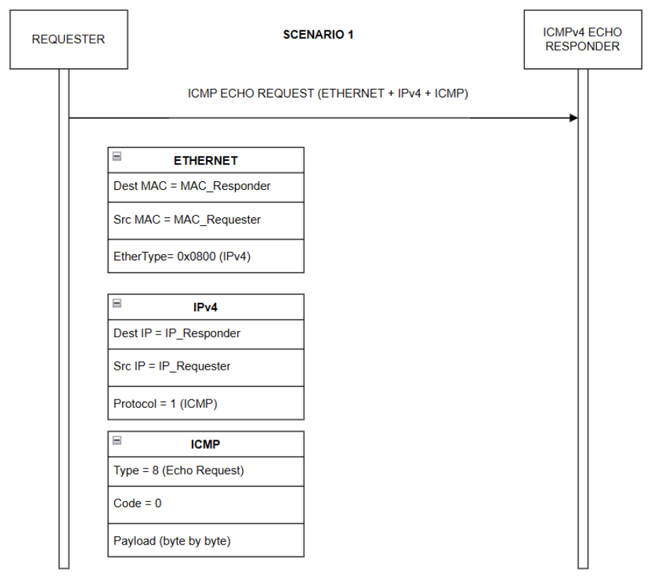
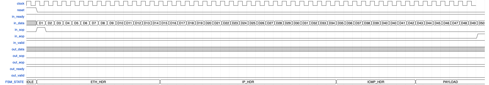
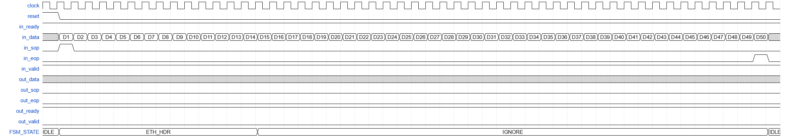
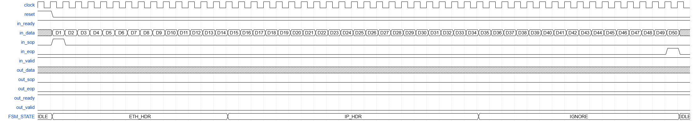
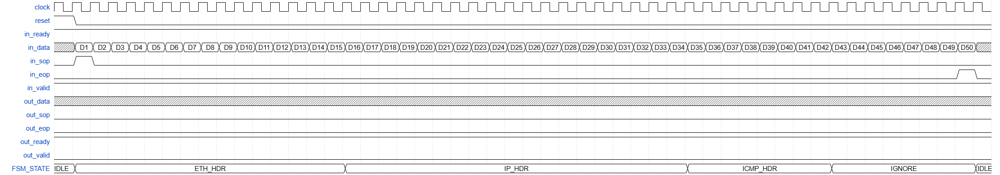
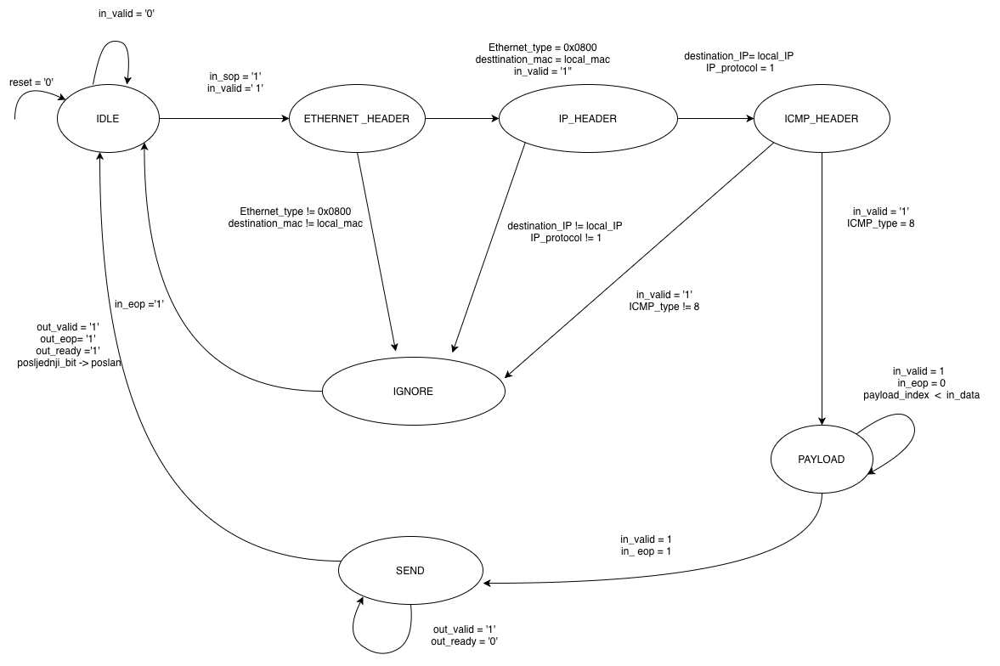

# ICMPv4-Echo-Responder

## Uvod

Internet Control Message Protocol (ICMP) predstavlja jedan od ključnih protokola u okviru TCP/IP arhitekture. Funkcioniše na mrežnom sloju i prvenstveno se koristi za razmjenu kontrolnih poruka između mrežnih uređaja. ICMP paketi obično nastaju kao odgovor na određeni problem u komunikaciji ili kao rezultat mrežnih provjera drugih  protokola [1].

Kao što je prikazano na slici 1, ICMP zaglavlje sastoji se od nekoliko osnovnih polja: 
* Type (tip)
* Code (kod)
* Checksum (kontrolna suma).
  
U dijelu podatka mogu biti definisana dodatna polja, poput identifikatora i sekvencijskog broja, koji se koriste u ICMP echo zahtjevima (tip 8) i echo odgovorima (tip 0) [1].

<strong>Slika 1:</strong> Prikaz ICMP format okvira.

ICMPv4 (Internet Control Message Protocol verzija 4) je verzija ICMP protokola koja se koristi unutar IPv4 mreža. Za razliku od nekih drugih protokola višeg sloja, ICMPv4 ne koristi pseudo-zaglavlje prilikom izračunavanja kontrolne sume. Kontrolna suma se računa samo na osnovu ICMP zaglavlja i podataka.
Kod ICMPv4 Echo Respondera, najvažnije su informativne poruke Echo Request (tip 8) i Echo Reply (tip 0). Kada uređaj primi Echo Request, generiše Echo Reply i pri tome je potrebno pravilno podesiti kontrolnu sumu. Budući da se pri kreiranju Echo Reply poruke mijenja prvenstveno polje Type (sa 8 na 0), kontrolna suma se može prilagoditi postepeno, što ubrzava proces odgovora i smanjuje potrebu za ponovnim izračunavanjem cijelog paketa [2].

## Avalon ST
Avalon-ST (Avalon Streaming) je standardno sučelje za jednosmjerni tok podataka sa ready/valid handshake protokolom.

#### Generic parametri

| Parametar     | Tip                        | Opis                                                                 |
|---------------|----------------------------|----------------------------------------------------------------------|
| IP_ADDRESS  | STD_LOGIC_VECTOR(31 DOWNTO 0) | IP adresa čvora, koristi se za provjeru odredišne adrese u ICMP paketima. |
| MAC_ADDRESS | STD_LOGIC_VECTOR(47 DOWNTO 0) | MAC adresa čvora, koristi se za formiranje Ethernet zaglavlja Echo Reply paketa. |

#### Ulazni signali (IN)

| Signal      | Tip                        | Opis                                                                 |
|-------------|----------------------------|----------------------------------------------------------------------|
| clock     | STD_LOGIC                | Glavni takt modula.                                                   |
| reset     | STD_LOGIC                | Resetuje modul i FSM u početno stanje (IDLE).                       |
| in_data   | STD_LOGIC_VECTOR(7 DOWNTO 0) | Ulazni bajtovi podataka sa Avalon-ST interfejsa.                     |
| in_valid  | STD_LOGIC                | Indikator da je in_data ispravan.                                     |
| in_sop    | STD_LOGIC                | Start of Packet – označava početak paketa.                            |
| in_eop    | STD_LOGIC                | End of Packet – označava kraj paketa.                                 |
| out_ready | STD_LOGIC                | Indikator da je odredište spremno za prijem izlaznih podataka.        |

#### Izlazni signali (OUT)

| Signal       | Tip                        | Opis                                                                 |
|--------------|----------------------------|----------------------------------------------------------------------|
| in_ready   | STD_LOGIC                | Signal da modul može primiti novi bajt podataka.                     |
| out_data   | STD_LOGIC_VECTOR(7 DOWNTO 0) | Izlazni bajtovi podataka (Echo Reply paket).                         |
| out_valid  | STD_LOGIC                | Indikator da je out_data ispravan i može biti pročitan.              |
| out_sop    | STD_LOGIC                | Start of Packet – označava početak Echo Reply paketa.                |
| out_eop    | STD_LOGIC                | End of Packet – označava kraj Echo Reply paketa.                     |

---
# Identifikovani scenariji

## Scenarij 1 - Kontinuirani prijem ICMP Echo Request paketa  

U ovom scenariju prikazan je prijem ICMP Echo Request paketa koji se prenosi unutar IPv4 paketa i Ethernet okvira. ICMPv4 Echo Responder parsira Ethernet, IPv4 i ICMP zaglavlja kako bi utvrdio da se radi o validnoj Echo Request poruci namijenjenoj njegovoj IP adresi. U ovom scenariju ne dolazi do generisanja odgovora.

<strong>Slika 2:</strong> Prikaz protokola prijema ICMP Echo Request paketa.

U ovom scenariju testira se osnovni mehanizam prijema ICMPv4 Echo Request paketa putem Avalon-ST interfejsa. Paket se prenosi kontinuirano, bajt po bajt, bez ikakvih prekida između uzastopnih bajtova. Pretpostavlja se da je prijemni interfejs uvijek spreman za prihvat podataka, zbog čega je signal in_ready stalno postavljen na logičku jedinicu. Svaki bajt paketa dolazi uz aktivan signal in_valid, čime se označava da su podaci na ulazu validni. Početak paketa je označen aktiviranjem signala in_sop na prvom bajtu, dok je kraj paketa označen signalom in_eop na posljednjem bajtu. Tokom prijema, modul prihvata svaki bajt odmah po njegovom dolasku, bez zadržavanja ili preskakanja podataka. Bajtovi se interno obrađuju u ispravnom redoslijedu, a ICMP zaglavlje se dekodira kako bi se prepoznalo da se radi o Echo Request poruci namijenjenoj IP adresi modula.

<strong>Slika 3:</strong> Prikaz scenarija 1 u WaveDrom dijagramu.

U Scenariju 1 bajtovi D1–D50 predstavljaju kompletan ICMP Echo Request paket koji je namijenjen ovom čvoru. Tokom prijema:
- D1–D6 (Destination MAC): modul prima i upoređuje Destination MAC adresu sa parametrom MAC_ADDRESS
- D7–D12 (Source MAC): izvorišna MAC adresa Ethernet okvira
- D13–D14 (EtherType): vrijednost 0x0800 (IPv4)
- D15–D34 (IPv4 header): iz IPv4 zaglavlja se provjerava da li je odredišna IP adresa jednaka IP_ADDRESS i da li je Protocol polje postavljeno na ICMP, IP zaglavlje uključuje Src IP, Dest IP i Protocol polje
- D35–D42 (ICMP header): iz ICMP zaglavlja se detektuje da je Type = 8 (Echo Request), ICMP zaglavlje uključuje Type, Code, Checksum, Identifier i Sequence Number
- D43–D50 (ICMP payload): podaci ICMP poruke (neobrađeni payload)

## Scenarij 2 - ICMP Echo Reply (odgovor na Echo Request)

Ovaj scenarij prikazuje razmjenu ICMP Echo Request i ICMP Echo Reply paketa između requester i responder strane. Nakon prijema zahtjeva, responder formira Echo Reply paket sa zamijenjenim izvorišnim i odredišnim adresama, dok ICMP zaglavlje ima polje Type postavljeno na vrijednost 0. Payload i identifikaciona polja prenose se neizmijenjena.

<strong>Slika 4:</strong> Prikaz protokola razmjene ICMP Echo Request i Echo Reply paketa.

U ovom scenariju verifikuje se sposobnost ICMPv4 Echo Responder modula da nakon prijema kompletnog ICMP Echo Request paketa, generiše i pošalje odgovarajući ICMP Echo Reply paket. Po detekciji kraja ulaznog paketa (signal in_eop), modul započinje proces formiranja odgovora, pri čemu se zamjenjuju izvorišne i odredišne MAC i IP adrese, dok se ICMP Type polje postavlja na vrijednost Echo Reply (0). Slanje ICMP Echo Reply paketa odvija se bajt po bajt, u kontinuiranom režimu, uz pretpostavku da je izlazni interfejs uvijek spreman za prihvatanje podataka, zbog čega je signal out_ready konstantno aktivan. Tokom cijelog trajanja slanja odgovora signal out_valid je aktivan. Na taj način se označava da su izlazni podaci validni. Signal out_sop označava početak, a signal out_eop kraj Echo Reply paketa.

<strong>Slika 5:</strong> Prikaz scenarija 2 u WaveDromu.

U Scenariju 2 ulazni bajtovi D1–D50 imaju isto protokolno značenje kao u Scenariju 1, ali predstavljaju validan ICMP Echo Request paket. Nakon prijema posljednjeg bajta (D50), modul započinje generisanje ICMP Echo Reply paketa. Izlazni bajtovi takođe se prenose bajt-po-bajt i imaju sljedeće značenje:
- R1 – R14: Ethernet zaglavlje sa zamijenjenim izvorišnim i odredišnim MAC adresama
- R15 – R34: IPv4 zaglavlje sa zamijenjenim izvorišnim i odredišnim IP adresama
- R35 – R42: ICMP zaglavlje sa poljem Type postavljenim na vrijednost 0 (Echo Reply)
- R43 – R50: ICMP payload identičan payloadu primljenog Echo Request paketa

## Scenarij 3 - Nije ICMP Echo poruka (ignorisanje)

U ovom scenariju ICMPv4 Echo Responder prima ispravan paket koji nije ICMP Echo Request ili nije namijenjen ovom uređaju. Na osnovu analize Ethernet-a, IPv4, MAC adrese i ICMP zaglavlja, paket se ignoriše. U ovom slučaju ne dolazi do generisanja ICMP Echo Reply poruke.

<strong>Slika 6:</strong> Prikaz protokola ignorisanja paketa koji nije ICMP Echo Request.

U ovom scenariju paket se ignoriše zbog neispravne odredišne MAC adrese u Ethernet zaglavlju. Ukoliko MAC adresa ne odgovara lokalnoj MAC adresi ICMPv4 Echo Respondera, paket se odbacuje na Ethernet sloju i ne dolazi do obrade IPv4 i ICMP zaglavlja, niti do generisanja ICMP Echo Reply poruke.
Prijem započinje aktiviranjem signala in_sop u trenutku D1, nakon čega FSM obrađuje Ethernet zaglavlje u intervalu D1–D14. Bajtovi D1–D6 predstavljaju odredišnu MAC adresu, tokom kojih se detektuje neusklađenost. Iako se greška prepoznaje na početku (D1-D6), modul završava prijem Ethernet zaglavlja, a zatim prelazi u stanje IGNORE i odbacuje ostatak paketa.

<strong>Slika 7:</strong> Prikaz scenarija 3 u WaveDromu za slučaj pogrešne MAC adrese.

U ovom scenariju ICMPv4 Echo Responder prima Ethernet okvir sa ispravnom odredišnom MAC adresom. U ovom slučaju, Ethernet zaglavlje se obrađuje. Nakon toga, prelazi u stanje IP_HDR u kojem se obrađuje IPv4 zaglavlje u intervalu D15–D34. IPv4 zaglavlje ima fiksnu dužinu od 20 bajtova i sadrži osnovna kontrolna polja, uključujući izvorišnu i odredišnu IP adresu. Tokom obrade IPv4 zaglavlja vrši se provjera odredišne IP adrese. Ukoliko IP adresa ne odgovara lokalnoj IP adresi ICMPv4 Echo Respondera, paket se odbacuje na mrežnom sloju. FSM zatim prelazi u stanje IGNORE, u kojem se ostatak paketa odbacuje, nema obrade ICMP zaglavlja i ne generiše se ICMP Echo Reply poruka. Po prijemu signala in_eop, FSM se vraća u stanje IDLE.

<strong>Slika 8:</strong> Prikaz scenarija 3 u WaveDromu za slučaj pogrešne IP adrese.

U ovom scenariju ICMPv4 Echo Responder ispravno obrađuje Ethernet zaglavlje (D1–D14) i IPv4 zaglavlje (D15–D34), nakon čega FSM prelazi u stanje ICMP_HDR. Tokom obrade ICMP zaglavlja (D35–D42) provjerava se tip ICMP poruke i osnovna kontrolna polja.
Kada ICMP poruka nije tipa Echo Request ili sadrži neispravne vrijednosti, paket se odbacuje na ICMP nivou. FSM prelazi u stanje IGNORE, u kojem se ostatak paketa odbacuje, bez aktiviranja izlaznih signala i bez generisanja ICMP Echo Reply poruke. Po prijemu signala in_eop, FSM se vraća u stanje IDLE.

<strong>Slika 9:</strong> Prikaz scenarija 3 u WaveDromu za slučaj neispravnog ICMP zaglavlja.

# Dijagram konačnog automata

Konačni automat (engl. Finite State Machine – FSM) predstavlja tehniku modeliranja sekvencijalnih logičkih sklopova koja se često koristi u dizajnu digitalnih komunikacionih sistema i mrežnih procesora. FSM omogućava precizno definisanje ponašanja sistema kroz skup jasno definisanih stanja, prelaza između stanja na osnovu ulaznih signala, kao i generisanje odgovarajućih izlaznih signala. U ovom projektu, konačni automat se koristi za implementaciju ICMPv4 Echo Responder modula, čiji je zadatak prijem, analiza i obrada mrežnih paketa, te generisanje ICMP Echo Reply poruka kao odgovor na primljene ICMP Echo Request pakete.

Dijagram stanja predstavlja grafičku specifikaciju konačnog automata i omogućava intuitivno razumijevanje toka obrade paketa. FSM parsira ulazni tok podataka bajt po bajt putem Avalon-ST interfejsa i identifikuje početak paketa, pri čemu vrši validaciju zaglavlja Ethernet, IP i ICMP slojeva. Nakon obrade ICMP payload-a, automat kontroliše slanje odgovora uz podršku ready/valid mehanizma.

Konačni automat ICMPv4 Echo Responder modula sastoji se od ukupno sedam stanja:

1. IDLE – Početno stanje u kojem modul ne obrađuje nikakav paket i spreman je za prijem novog ulaznog toka podataka. Signal reset vraća automat u stanje IDLE, dok je izlazni interfejs neaktivan. Uslov za prelazak u ETHERNET_HEADER stanje je in_valid = '1' i in_sop = '1'. FSM ostaje u ovom stanju dok je in_valid = '0'.
  
3. ETHERNET_HEADER – Obrada zaglavlja paketa u kojem se vrši parsiranje i validacija zaglavlja mrežnog paketa. Tokom ovog stanja, automat provjerava:
- da li je Ethernet tip jednak vrijednosti 0x0800, čime se potvrđuje IPv4 protokol,
- da li odredišna MAC adresa odgovara lokalnoj MAC adresi modul.

Ukoliko bilo koji od navedenih uslova nije ispunjen, automat zaključuje da paket nije relevantan za ICMP Echo Responder i prelazi u stanje IGNORE. Ako su svi uslovi ispunjeni, automat prelazi u stanje IP_HEADER. 

3. IP_HEADER - Obrada IPv4 zaglavlje paketa. Provjerava se da li je odredišna IP adresa jednaka lokalnoj IP adresi modula i da li polje Protocol ima vrijednost 1. Na taj način se potvrđuje da se radi o ICMP paketu. Ako su uslovi ispunjeni, FSM prelazi u stanje ICMP_HEADER. U suprotnom, paket se odbacuje prelaskom u stanje IGNORE.

4. ICMP_HEADER - Prijem ICMP zaglavlja paketa nakon što je IP header pročitan. FSM odlučuje da li je paket ICMP Echo Request ili ne. Ako ICMP_type = 8 (Echo Request), FSM prelazi u PAYLOAD. Ako ICMP_type ≠ 8, onda FSM prelazi u IGNORE.
  
5. PAYLOAD - FSM u ovom stanju aktivno prima bajt po bajt, svaki označen sa signalom in_valid. Svi primljeni bajtovi se pohranjuju u interni buffer (payload_mem), a svaki novi bajt povećava internu adresu (payload_index), kako bi se sačuvao pravilan redoslijed podataka.
FSM ostaje u ovom stanju sve dok ne stigne signal in_eop, koji označava kraj paketa. Po primanju poslednjeg bajta payload-a, FSM prelazi u stanje SEND, spreman za generisanje i slanje Echo Reply paketa.

Također, modul je u ovom stanju stalno spreman za prijem (in_ready = '1'), ali ne generiše nikakve izlazne podatke (out_valid = '0').

6. SEND - U stanju SEND, modul generiše i šalje Echo Reply paket kao odgovor na prethodno primljeni Echo Request. Paket se šalje bajt po bajt koristeći interni buffer, koji sadrži kompletan paket, uključujući Ethernet, IP zaglavlja, ICMP zaglavlje i payload, uz aktivan signal out_valid. Slanje se vrši samo kada je out_ready = '1', čime se poštuje Avalon-ST ready/valid mehanizam. Prvi bajt odgovora označen je signalom out_sop = '1', dok je poslednji bajt označen signalom out_eop = '1'. FSM ostaje u ovom stanju dok svi bajtovi nisu uspješno poslani. Nakon slanja posljednjeg bajta, FSM se vraća u stanje IDLE.
FSM ostaje u SEND dok nisu poslani svi bajtovi ili dok interfejs nije spreman, čime se osigurava da nema gubljenja podataka. Nakon što je poslednji bajt uspješno poslan i interfejs spreman (out_ready = '1' i brojac = posljednji_bit), FSM prelazi u stanje IDLE i spreman je za prijem sljedećeg paketa.
   
8. IGNORE – Ignorisanje paketa koje nisu tip ICMP Echo Request poruke. Na ovaj način se obezbjeđuje da nevalidni paketi ne utiču na rad modula. 

<strong>Slika 10:</strong> Prikaz FSM dijagrama pomoću alata draw.io.

# Modeliranje u VHDL-u

# Verifikacija rezultata pomoću simulacijskog alata ModelSim

# Zaključak

## Literatura
[1] "Detection of Covert Channels over ICMP Protocol", Dostupno na: https://hal.science/hal-02381398/file/AICCSA%202017%20sirine%20sayadi.pdf

[2] "The Design and Implementation of an IPv6/IPv4 Network Address and Protocol Translator", Dostupno na: https://www.usenix.org/legacy/publications/library/proceedings/usenix98/full_papers/fiuczynski/fiuczynski.pdf

[3] Volnei A. Pedroni, Circuit Design and Simulation with VHDL (poglavlje 11), The MIT Press, Cambridge, Massachussets, 2nd edition, 2010

[4] Intel, F. P. G. A., Avalon® interface specifications., Tech. Rep., MNL-AVABUSREF, 2021.

