# ICMPv4-Echo-Responder

## Uvod

Internet Control Message Protocol (ICMP) predstavlja jedan od ključnih protokola u okviru TCP/IP arhitekture. Funkcioniše na mrežnom sloju i prvenstveno se koristi za razmjenu kontrolnih poruka između mrežnih uređaja. ICMP paketi obično nastaju kao odgovor na određeni problem u komunikaciji ili kao rezultat mrežnih provjera drugih  protokola [1].

Kao što je prikazano na slici 1, ICMP zaglavlje sastoji se od nekoliko osnovnih polja: 
* Type (tip)
* Code (kod)
* Checksum (kontrolna suma).
  
U dijelu podatka mogu biti definisana dodatna polja, poput identifikatora i sekvencijskog broja, koji se koriste u ICMP echo zahtjevima (tip 8) i echo odgovorima (tip 0) [1].

<strong>Slika 1:</strong> Prikaz ICMP format okvira.

ICMPv4 (Internet Control Message Protocol verzija 4) je verzija ICMP protokola koja se koristi unutar IPv4 mreža. Za razliku od nekih drugih protokola višeg sloja, ICMPv4 ne koristi pseudo-zaglavlje prilikom izračunavanja kontrolne sume. Kontrolna suma se računa samo na osnovu ICMP zaglavlja i podataka.
Kod ICMPv4 Echo Respondera, najvažnije su informativne poruke Echo Request (tip 8) i Echo Reply (tip 0). Kada uređaj primi Echo Request, generiše Echo Reply i pri tome je potrebno pravilno podesiti kontrolnu sumu. Budući da se pri kreiranju Echo Reply poruke mijenja prvenstveno polje Type (sa 8 na 0), kontrolna suma se može prilagoditi postepeno, što ubrzava proces odgovora i smanjuje potrebu za ponovnim izračunavanjem cijelog paketa [2].

## Avalon ST
Avalon-ST (Avalon Streaming) je standardno sučelje za jednosmjerni tok podataka sa ready/valid handshake protokolom [5].

#### Generic parametri

| Parametar     | Tip                        | Opis                                                                 |
|---------------|----------------------------|----------------------------------------------------------------------|
| IP_ADDRESS  | STD_LOGIC_VECTOR(31 DOWNTO 0) | IP adresa čvora, koristi se za provjeru odredišne adrese u ICMP paketima. |
| MAC_ADDRESS | STD_LOGIC_VECTOR(47 DOWNTO 0) | MAC adresa čvora, koristi se za formiranje Ethernet zaglavlja Echo Reply paketa. |

#### Ulazni signali (IN)

| Signal      | Tip                        | Opis                                                                 |
|-------------|----------------------------|----------------------------------------------------------------------|
| clock     | STD_LOGIC                | Glavni takt modula.                                                   |
| reset     | STD_LOGIC                | Resetuje modul i FSM u početno stanje (IDLE).                       |
| in_data   | STD_LOGIC_VECTOR(7 DOWNTO 0) | Ulazni bajtovi podataka sa Avalon-ST interfejsa.                     |
| in_valid  | STD_LOGIC                | Indikator da je in_data ispravan.                                     |
| in_sop    | STD_LOGIC                | Start of Packet – označava početak paketa.                            |
| in_eop    | STD_LOGIC                | End of Packet – označava kraj paketa.                                 |
| out_ready | STD_LOGIC                | Indikator da je odredište spremno za prijem izlaznih podataka.        |

#### Izlazni signali (OUT)

| Signal       | Tip                        | Opis                                                                 |
|--------------|----------------------------|----------------------------------------------------------------------|
| in_ready   | STD_LOGIC                | Signal da modul može primiti novi bajt podataka.                     |
| out_data   | STD_LOGIC_VECTOR(7 DOWNTO 0) | Izlazni bajtovi podataka (Echo Reply paket).                         |
| out_valid  | STD_LOGIC                | Indikator da je out_data ispravan i može biti pročitan.              |
| out_sop    | STD_LOGIC                | Start of Packet – označava početak Echo Reply paketa.                |
| out_eop    | STD_LOGIC                | End of Packet – označava kraj Echo Reply paketa.                     |

---
# Identifikovani scenariji

## Scenarij 1 - ICMP Echo Request i Reply

Ovaj scenarij prikazuje razmjenu ICMP Echo Request i ICMP Echo Reply paketa između requester i responder strane. Nakon prijema zahtjeva, responder formira Echo Reply paket sa zamijenjenim izvorišnim i odredišnim adresama, dok ICMP zaglavlje ima polje Type postavljeno na vrijednost 0. Payload i identifikaciona polja prenose se neizmijenjena.

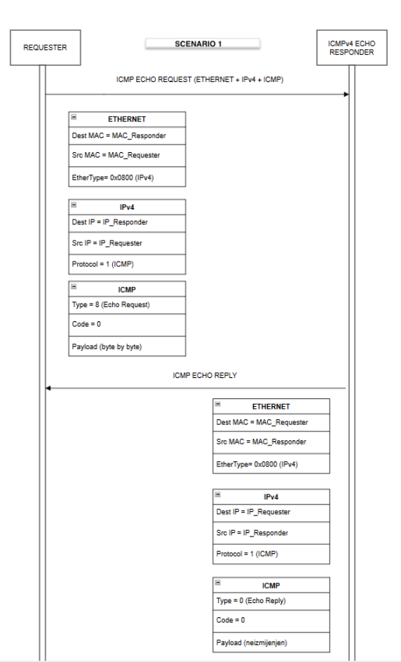

<strong>Slika 2:</strong> Prikaz protokola razmjene ICMP Echo Request i Echo Reply paketa.

U ovom scenariju verifikuje se sposobnost ICMPv4 Echo Responder modula da nakon prijema kompletnog ICMP Echo Request paketa, generiše i pošalje odgovarajući ICMP Echo Reply paket. Po detekciji kraja ulaznog paketa (signal in_eop), modul započinje proces formiranja odgovora, pri čemu se zamjenjuju izvorišne i odredišne MAC i IP adrese, dok se ICMP Type polje postavlja na vrijednost Echo Reply (0). Slanje ICMP Echo Reply paketa odvija se bajt po bajt, u kontinuiranom režimu, uz pretpostavku da je izlazni interfejs uvijek spreman za prihvatanje podataka, zbog čega je signal out_ready konstantno aktivan. Tokom cijelog trajanja slanja odgovora signal out_valid je aktivan. Na taj način se označava da su izlazni podaci validni. Signal out_sop označava početak, a signal out_eop kraj Echo Reply paketa.

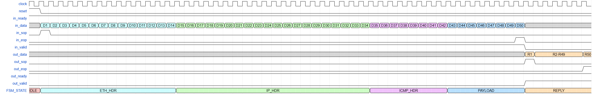

<strong>Slika 3:</strong> Prikaz scenarija 1 u WaveDromu.

U Scenariju 1 ulazni bajtovi D1–D50 imaju sljedeće protokolno značenje:

1. D1-D14 (Ethernet header): Ethernet zaglavlje uključuje sljedeća polja:
  - D1–D6 (Destination MAC): modul prima i upoređuje Destination MAC adresu sa parametrom MAC_ADDRESS,
  - D7–D12 (Source MAC): izvorišna MAC adresa Ethernet okvira,
  - D13–D14 (EtherType): vrijednost 0x0800 (IPv4).
2. D15–D34 (IPv4 header): iz IPv4 zaglavlja se provjerava da li je odredišna IP adresa jednaka IP_ADDRESS i da li je Protocol polje postavljeno na ICMP. IP zaglavlje se može opisati na sljedeći način:
  - D15: Ovo polje sadrži verziju IP protokola (IPv4) i dužinu zaglavlja,
  - D16: Označava prioritet i kvalitet servisa (ToS),
  - D17–D18: Ukupna dužina IP paketa (zaglavlje + payload),
  - D19–D20: Identifikator fragmentacije,
  - D21–D22: Polja vezana za fragmentaciju,
  - D23: Time To Live (TTL) koji ograničava životni vijek paketa u mreži,
  - D24: Protocol polje IPv4 zaglavlja,
  - D25-D26: Header Checksum,
  - D27-D30: Izvorišna IP adresa pošiljaoca,
  - D31-D34: Odredišna IP adresa IPv4 paketa.
3. D35–D42 (ICMP header): ICMP zaglavlje ima fiksnu dužinu od 8 bajtova i sastoji se od sljedećih polja:
  - D35: Type
  - D36: Code
  - D37–D38: Checksum
  - D39–D40: Identifier
  - D41–D42: Sequence Number
4. D43–D50 (Payload): predstavlja završni dio okvira i u ovom scenariju se tretira kao niz korisničkih podataka koji se ne obrađuju, već se u potpunosti i neizmijenjeni prenose u odgovor.

Odredišna MAC adresa, odredišna IP adresa i ICMP Type polje imaju ključnu ulogu u implementaciji, jer se njihova vrijednost provjerava u VHDL kodu kako bi se obradili samo ICMP Echo Request paketi namijenjeni ovom modulu. Nakon prijema posljednjeg bajta (D50), modul započinje generisanje ICMP Echo Reply paketa. Izlazni bajtovi takođe se prenose bajt-po-bajt i imaju sljedeće značenje:
1. R1 – R14: Ethernet zaglavlje sa zamijenjenim izvorišnim i odredišnim MAC adresama,
2. R15 – R34: IPv4 zaglavlje sa zamijenjenim izvorišnim i odredišnim IP adresama,
3. R35 – R42: ICMP zaglavlje sa poljem Type postavljenim na vrijednost 0 (Echo Reply),
4. R43 – R50: Payload identičan payloadu primljenog Echo Request paketa.

## Scenarij 2 - Nije ICMP Echo poruka (ignorisanje)

U ovom scenariju ICMPv4 Echo Responder prima ispravan paket koji nije ICMP Echo Request ili nije namijenjen ovom uređaju. Na osnovu analize Ethernet-a, IPv4, MAC adrese i ICMP zaglavlja, paket se ignoriše. U ovom slučaju ne dolazi do generisanja ICMP Echo Reply poruke.

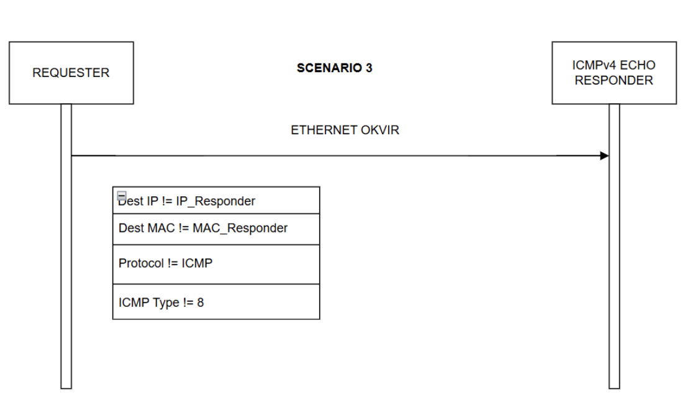

<strong>Slika 4:</strong> Prikaz protokola ignorisanja paketa koji nije ICMP Echo Request.

U ovom scenariju paket se ignoriše zbog neispravne odredišne MAC adrese u Ethernet zaglavlju. Ukoliko MAC adresa ne odgovara lokalnoj MAC adresi ICMPv4 Echo Respondera, paket se odbacuje na Ethernet sloju i ne dolazi do obrade IPv4 i ICMP zaglavlja, niti do generisanja ICMP Echo Reply poruke.
Prijem započinje aktiviranjem signala in_sop u trenutku D1, nakon čega FSM obrađuje Ethernet zaglavlje u intervalu D1–D14. Bajtovi D1–D6 predstavljaju odredišnu MAC adresu, tokom kojih se detektuje neusklađenost. Iako se greška prepoznaje na početku (D1-D6), modul završava prijem Ethernet zaglavlja, a zatim prelazi u stanje IGNORE i odbacuje ostatak paketa.

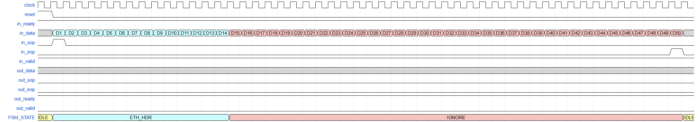

<strong>Slika 5:</strong> Prikaz scenarija 2 u WaveDromu za slučaj pogrešne MAC adrese.

U ovom scenariju ICMPv4 Echo Responder prima Ethernet okvir sa ispravnom odredišnom MAC adresom. U ovom slučaju, Ethernet zaglavlje se obrađuje. Nakon toga, prelazi u stanje IP_HDR u kojem se obrađuje IPv4 zaglavlje u intervalu D15–D34. IPv4 zaglavlje ima fiksnu dužinu od 20 bajtova i sadrži osnovna kontrolna polja, uključujući izvorišnu i odredišnu IP adresu. Tokom obrade IPv4 zaglavlja vrši se provjera odredišne IP adrese. Ukoliko IP adresa ne odgovara lokalnoj IP adresi ICMPv4 Echo Respondera, paket se odbacuje na mrežnom sloju. FSM zatim prelazi u stanje IGNORE, u kojem se ostatak paketa odbacuje, nema obrade ICMP zaglavlja i ne generiše se ICMP Echo Reply poruka. Po prijemu signala in_eop, FSM se vraća u stanje IDLE.

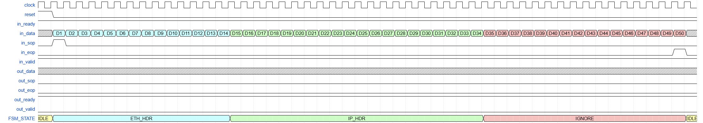

<strong>Slika 6:</strong> Prikaz scenarija 2 u WaveDromu za slučaj pogrešne IP adrese.

U ovom scenariju ICMPv4 Echo Responder ispravno obrađuje Ethernet zaglavlje (D1–D14) i IPv4 zaglavlje (D15–D34), nakon čega FSM prelazi u stanje ICMP_HDR. Tokom obrade ICMP zaglavlja (D35–D42) provjerava se tip ICMP poruke i osnovna kontrolna polja.
Kada ICMP poruka nije tipa Echo Request ili sadrži neispravne vrijednosti, paket se odbacuje na ICMP nivou. FSM prelazi u stanje IGNORE, u kojem se ostatak paketa odbacuje, bez aktiviranja izlaznih signala i bez generisanja ICMP Echo Reply poruke. Po prijemu signala in_eop, FSM se vraća u stanje IDLE.

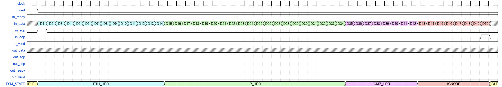

<strong>Slika 7:</strong> Prikaz scenarija 2 u WaveDromu za slučaj neispravnog ICMP zaglavlja.

# Dijagram konačnog automata

Konačni automat (engl. Finite State Machine – FSM) predstavlja tehniku modeliranja sekvencijalnih logičkih sklopova koja se često koristi u dizajnu digitalnih komunikacionih sistema i mrežnih procesora. FSM omogućava precizno definisanje ponašanja sistema kroz skup jasno definisanih stanja, prelaza između stanja na osnovu ulaznih signala, kao i generisanje odgovarajućih izlaznih signala. U ovom projektu, konačni automat se koristi za implementaciju ICMPv4 Echo Responder modula, čiji je zadatak prijem, analiza i obrada mrežnih paketa, te generisanje ICMP Echo Reply poruka kao odgovor na primljene ICMP Echo Request pakete.

Dijagram stanja predstavlja grafičku specifikaciju konačnog automata i omogućava intuitivno razumijevanje toka obrade paketa. FSM parsira ulazni tok podataka bajt po bajt putem Avalon-ST interfejsa i identifikuje početak paketa, pri čemu vrši validaciju zaglavlja Ethernet, IP i ICMP slojeva. Nakon obrade ICMP payload-a, automat kontroliše slanje odgovora uz podršku ready/valid mehanizma.

Konačni automat ICMPv4 Echo Responder modula sastoji se od ukupno sedam stanja:

1. IDLE – Početno stanje u kojem modul ne obrađuje nijedan paket i nalazi se u stanju mirovanja. FSM ostaje u ovom stanju dok je signal in_valid = '0'.
Prelazak u stanje ETHERNET_HEADER dešava se kada su in_valid = '1' i in_sop = '1', čime se označava početak novog Ethernet okvira. Signal reset vraća automat u stanje IDLE.
  
3. ETHERNET_HEADER – U ovom stanju FSM obrađuje Ethernet zaglavlje paketa. Tokom prijema bajtova provjerava se:
- da li je Ethernet tip jednak 0x0800, čime se potvrđuje da se radi o IPv4 paketu.
  
Ako uslov nije ispunjen, FSM prelazi u stanje IGNORE. Ako je Ethernet tip validan, nakon završetka obrade Ethernet zaglavlja FSM prelazi u stanje IP_HEADER. 

3. IP_HEADER - U stanju IP_HEADER vrši se parsiranje IPv4 zaglavlja. FSM provjerava:
- da li je polje Protocol jednako 1, čime se potvrđuje da se radi o ICMP paketu.
  
Ukoliko uslov nije ispunjen, paket se odbacuje prelaskom u stanje IGNORE. Ako je protokol ispravan, FSM prelazi u stanje ICMP_HEADER.

4. ICMP_HEADER - U ovom stanju FSM obrađuje ICMP zaglavlje paketa. Provjerava se vrijednost polja ICMP Type:
- ako je ICMP_type = 8 (Echo Request), onda FSM prelazi u stanje PAYLOAD,
- ako je vrijednost različita od 8, paket se smatra nevalidnim i FSM prelazi u stanje IGNORE.
  
5. PAYLOAD - U stanju PAYLOAD FSM prima ICMP payload bajt-po-bajt, pri čemu je signal in_ready = '1'. Svaki primljeni bajt se redom smješta u odgovarajuću lokaciju internog buffera, čime se obezbjeđuje ispravan raspored i kontinuitet podataka. FSM ostaje u ovom stanju sve dok se ne detektuje signal in_eop = '1', koji označava kraj paketa. Nakon prijema posljednjeg bajta payload-a, FSM prelazi u stanje SEND.

6. SEND - U stanju SEND modul generiše i šalje ICMP Echo Reply paket. Slanje se vrši bajt-po-bajt putem izlaznog Avalon-ST interfejsa uz aktivan signal out_valid. Prijenos podataka se odvija isključivo kada je out_ready = '1', čime se poštuje ready/valid mehanizam.
Prvi bajt odgovora označen je signalom out_sop = '1', dok je posljednji bajt označen signalom out_eop = '1'. Nakon uspješnog slanja kompletnog paketa, FSM se vraća u stanje IDLE i spreman je za prijem novog paketa.
   
8. IGNORE – Stanje IGNORE služi za odbacivanje paketa koji ne zadovoljavaju uslove validacije (neispravan Ethernet tip, IP protokol ili ICMP tip). U ovom stanju FSM ne generiše izlazne podatke i nastavlja sa prijemom ulaznih bajtova sve do kraja paketa. Nakon detekcije in_eop, automat se vraća u stanje IDLE.

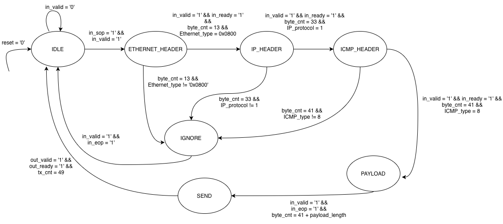

<strong>Slika 8:</strong> Prikaz FSM dijagrama pomoću alata draw.io.

# Modeliranje u VHDL-u

ICMPv4 Echo Responder je realizovan korištenjem jezika za opis hardvera VHDL i zasniva se na konačnom automatu stanja (FSM). Komunikacija sa okruženjem ostvarena je putem Avalon Streaming (Avalon-ST) sučelja, uz korištenje standardnog ready/valid mehanizma za kontrolu protoka podataka.

Modul prima Ethernet okvire bajt-po-bajt, pri čemu se svaki bajt skladišti u interni bafer. Obrada paketa organizovana je kroz FSM stanja koja obuhvataju prijem i provjeru Ethernet, IPv4 i ICMP zaglavlja, kao i prijem korisničkog sadržaja. Validnost paketa se utvrđuje provjerom destinacijske MAC adrese, EtherType polja, IP protokola, destinacijske IP adrese i ICMP tipa poruke.

U slučaju prijema validnog ICMP Echo Request paketa, modul generiše ICMP Echo Reply zamjenom izvorišnih i odredišnih MAC i IP adresa te izmjenom ICMP tipa poruke. Odgovor se šalje sekvencijalno, bajt po bajt, uz poštivanje out_ready signala i pravilno označavanje početka i kraja okvira. Paketi koji ne ispunjavaju uslove validnosti se ignorišu, bez generisanja izlaznog odgovora. 

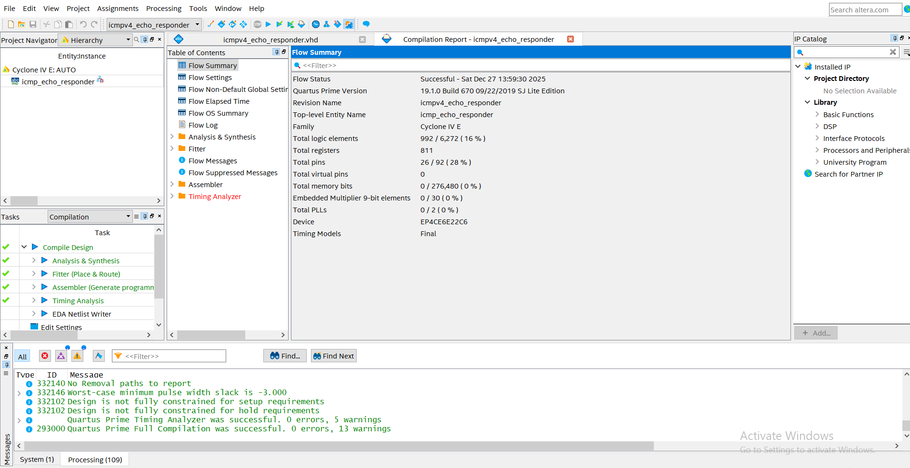

<strong>Slika 9:</strong> Prikaz kompilacije dizajna (engl. compilation report).

Preglednik stanja (engl. *State Machine Viewer*) omogućava grafički prikaz stanja konačnog automata implementiranog u okviru ICMPv4 Echo Responder modula, definisanog na osnovu VHDL koda i analiziranog korištenjem alata Intel Quartus Prime. Ovaj alat pruža uvid u stvarnu strukturu FSM-a nakon sinteze, uključujući stanja i prelaze koji upravljaju prijemom, obradom i generisanjem ICMP paketa. Na osnovu prikaza dobijenog u State Machine Viewer-u, koji je prikazan na slici 9, izvršena je verifikacija korektnosti dijagrama konačnih stanja prethodno kreiranog korištenjem alata draw.io. Ovim je potvrđena usklađenost implementiranog FSM-a sa projektovanim ponašanjem ICMPv4 Echo Responder modula.

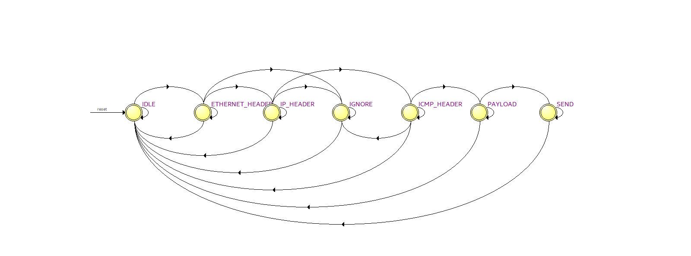

<strong>Slika 10:</strong> Prikaz verifikacije dijagrama konačnih stanja.

# Verifikacija rezultata pomoću simulacijskog alata ModelSim
## Prvi scenario verifikacije 

U prvom verifikacionom scenariju testiran je slučaj kada pristigli okvir sadrži ispravnu odredišnu MAC i IP adresu definisanu u generičkim parametrima modula. Cilj je bio potvrditi da modul icmp_echo_responder pravilno parsira ulaz i generiše ICMP Echo Reply odgovor. Simulacija pokazuje korektnu zamjenu izvornih i odredišnih adresa, prelazak stanja iz IDLE u REPLY i povratak u IDLE po završetku prenosa.

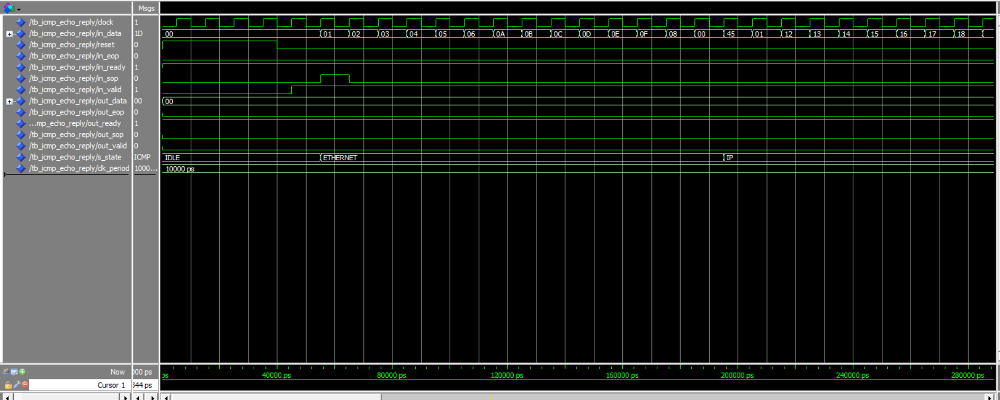

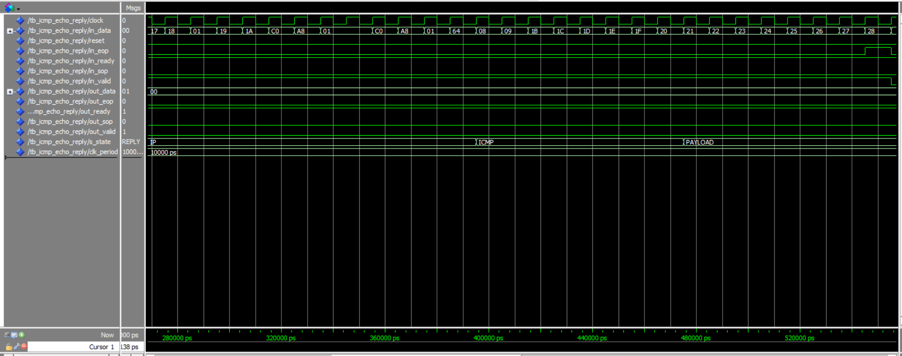

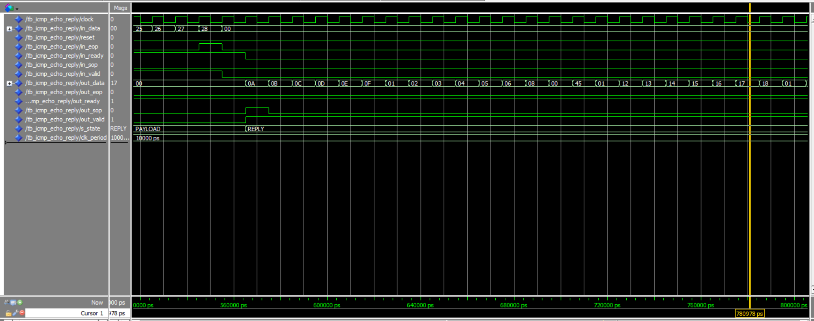

<strong>Slika 11:</strong> Prikaz verifikacije rezultata pomoću ModelSim-a za prvi scenario.

## Prvi scenario verifikacije - testiranje ready/valid handshake mehanizma

U prvom verifikacionom scenariju testiran je ispravan rad modula icmp_echo_responder prilikom prijema validnog ICMPv4 Echo Request paketa, uz istovremenu provjeru korektne implementacije ready/valid handshake mehanizma na ulaznom i izlaznom interfejsu.
Pristigli Ethernet okvir sadrži ispravne odredišne MAC i IPv4 adrese definisane generičkim parametrima modula. Nakon uspješnog parsiranja Ethernet i IPv4 zaglavlja, modul prepoznaje ICMP Echo Request poruku i započinje generisanje ICMP Echo Reply odgovora. Tokom obrade paketa vrši se pravilna zamjena izvornih i odredišnih MAC i IP adresa.
Poseban fokus ovog scenarija stavljen je na verifikaciju ready/valid handshake kontrole toka podataka. Ulazni bajtovi se prihvataju isključivo u taktovima kada su signali in_valid i in_ready istovremeno aktivni. U periodima kada je in_ready privremeno deaktiviran, modul pauzira prijem podataka, pri čemu se ulazni podaci zadržavaju stabilnim i ne dolazi do gubitka ili narušavanja redoslijeda bajtova.
Na izlaznom interfejsu, signal out_valid se aktivira tek nakon pripreme ICMP Echo Reply paketa, dok se prenos podataka vrši samo kada je i signal out_ready aktivan. U slučaju privremenog zastoja na izlazu (out_ready = '0'), izlazni podaci ostaju stabilni sve dok se handshake ponovo ne uspostavi, nakon čega se prenos nastavlja bez prekida. Po završetku slanja ICMP Echo Reply paketa, modul se ispravno vraća u početno stanje i spreman je za obradu narednih Ethernet okvira.

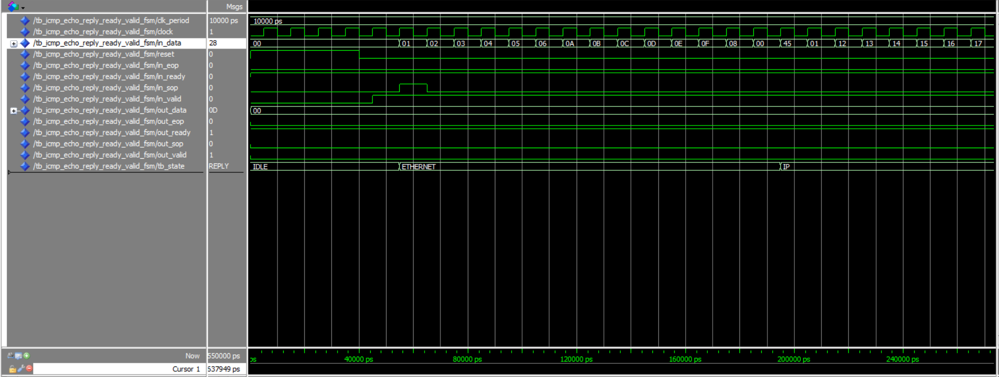

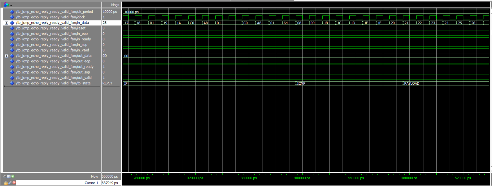

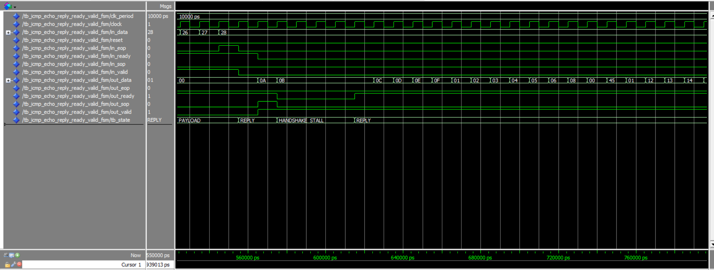

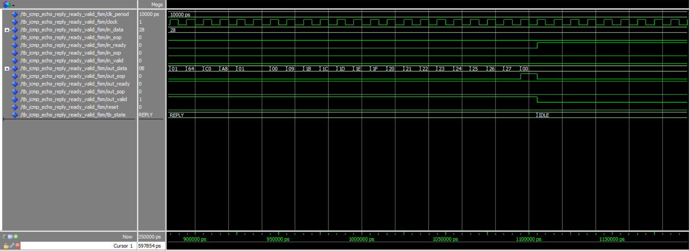

<strong>Slika 12:</strong> Prikaz verifikacije rezultata pomoću ModelSim-a za ready/valid handshake scenario.

## Drugi scenario verifikacije – pogrešna MAC adresa

U drugom scenariju izvršena je verifikacija rada sklopa u situaciji kada pristigli Ethernet okvir sadrži MAC adresu koja se ne podudara sa adresom definisanom u generičkom parametru modula. Putem ModelSim testbench-a generisana je kompletna sekvenca paketa koja obuhvata Ethernet, IPv4 i ICMP zaglavlje. U simulaciji je namjerno postavljena neispravna odredišna MAC adresa.

Cilj ovog scenarija bio je potvrditi da modul icmp_echo_responder pravilno ignoriše pakete koji mu nisu namijenjeni. Rezultati simulacije pokazuju da u slučaju pogrešne MAC adrese signal in_ready ostaje aktivan, ali se ne generiše ICMP Echo Reply odgovor niti dolazi do prelaska automata u stanje slanja izlaznih podataka. U ovoj situaciji ignoriše se paket i ostaje u IDLE stanju, čime je potvrđena ispravna funkcionalnost modula.

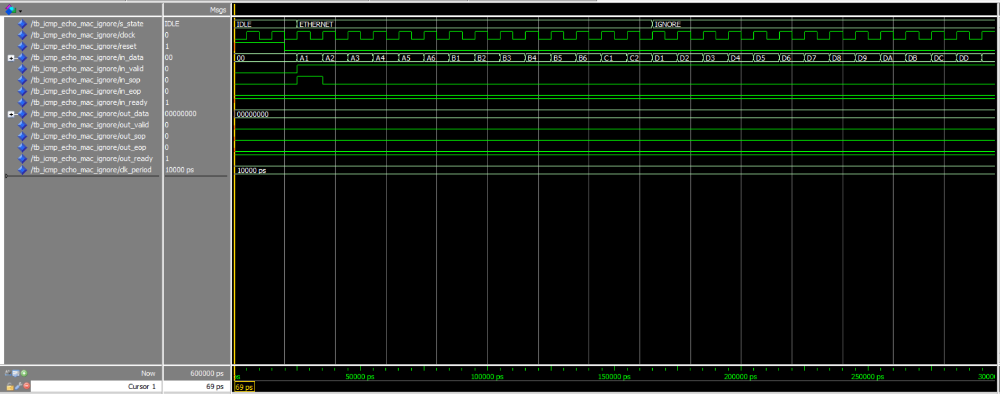

<strong>Slika 13:</strong> Prikaz verifikacije rezultata pomoću ModelSim-a za drugi scenario pogrešne MAC adrese.

## Drugi scenario verifikacije – pogrešna MAC adresa (ready/valid handshake)

U ovom scenariju testiran je rad modula icmp_echo_responder u slučaju kada pristigli Ethernet okvir sadrži neispravnu odredišnu MAC adresu, koja se ne podudara sa MAC adresom definisanom generičkim parametrom modula. Cilj scenarija je potvrditi da se paket pravilno ignoriše (ne generiše se ICMP Echo Reply), kao i da modul korektno implementira ready/valid handshake mehanizam u režimu odbacivanja paketa.
Tokom prijema okvira, ulazni bajtovi se prihvataju isključivo kada su in_valid i in_ready istovremeno aktivni. U periodima kada je in_ready = '0', modul pauzira prijem bez gubitka podataka. Nastavak parsiranja se vrši tek nakon ponovne aktivacije in_ready. Nakon analize Ethernet zaglavlja i detekcije pogrešne MAC adrese, modul prelazi u stanje IGNORE, gdje nastavlja da propušta ostatak ulaznog okvira do in_eop, bez pokretanja generisanja odgovora.
Na izlaznom interfejsu, tokom cijelog scenarija signal out_valid ostaje neaktivan, nezavisno od stanja signala out_ready, čime se potvrđuje da modul ne šalje nikakve podatke za pakete koji mu nisu namijenjeni.

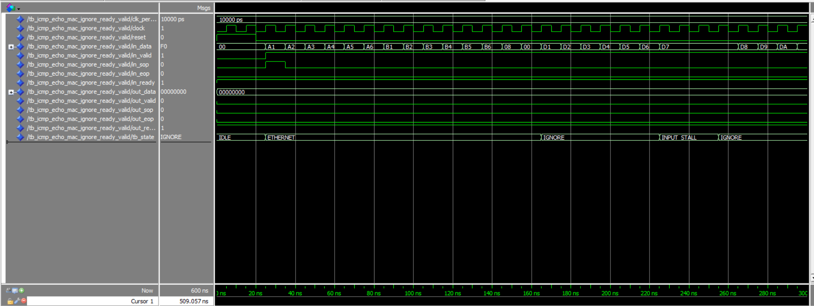

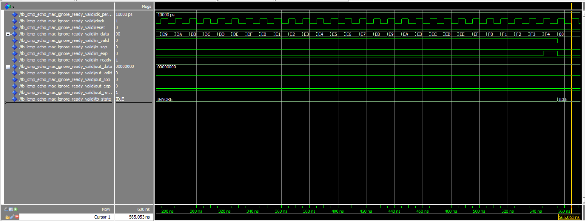

<strong>Slika 14:</strong> Prikaz verifikacije rezultata pomoću ModelSim-a za drugi scenario pogrešne MAC adrese i ready/valid handshake mehanizma.

## Drugi scenario verifikacije – pogrešna IP adresa

U ovom scenariju verifikovan je rad modula icmp_echo_responder u slučaju kada pristigli Ethernet okvir sadrži pogrešnu odredišnu IPv4 adresu. Nakon analize IP zaglavlja, modul pravilno prepoznaje da paket nije namijenjen ovom uređaju i prelazi u stanje ignorisanja.
Rezultati ModelSim simulacije potvrđuju da se u ovom slučaju ne generiše ICMP Echo Reply odgovor. Modul se po završetku prijema okvira ispravno vraća u IDLE stanje i spreman je za obradu narednih paketa.

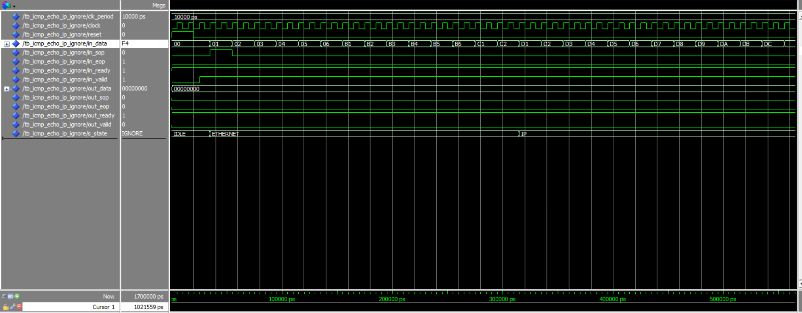

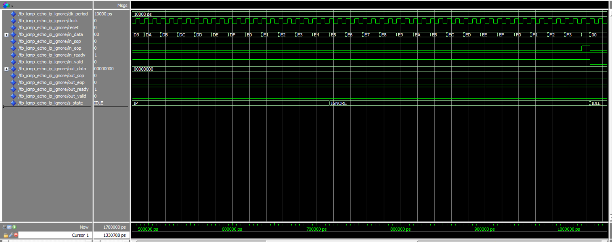

<strong>Slika 15:</strong> Prikaz verifikacije rezultata pomoću ModelSim-a za drugi scenario pogrešne IP adrese.

## Drugi scenario verifikacije – pogrešna IP adresa (ready/valid handshake)

U ovom scenariju testiran je rad modula icmp_echo_responder u slučaju kada pristigli Ethernet okvir sadrži neispravnu odredišnu IP adresu, koja se ne podudara sa IP adresom definisanom generičkim parametrom modula. Cilj scenarija je potvrditi da se paket pravilno ignoriše (ne generiše se ICMP Echo Reply), kao i da modul korektno implementira ready/valid handshake mehanizam u režimu odbacivanja paketa.
Tokom prijema okvira, ulazni bajtovi se prihvataju isključivo kada su signali in_valid i in_ready istovremeno aktivni. U periodima kada je in_ready = '0', modul pauzira prijem bez gubitka podataka, a nastavak parsiranja se vrši tek nakon ponovne aktivacije signala in_ready. Time je obezbijeđena ispravna sinhronizacija prijema podataka u skladu sa ready/valid protokolom.
Nakon analize Ethernet i IPv4 zaglavlja i detekcije pogrešne odredišne IP adrese, modul prelazi u stanje IGNORE, u kojem nastavlja da prihvata ostatak ulaznog okvira do signala in_eop, bez pokretanja procesa generisanja ICMP Echo Reply odgovora.
Na izlaznom interfejsu, tokom cijelog scenarija signal out_valid ostaje neaktivan, nezavisno od stanja signala out_ready, čime se potvrđuje da modul ne generiše izlazne podatke za pakete koji mu nisu namijenjeni.

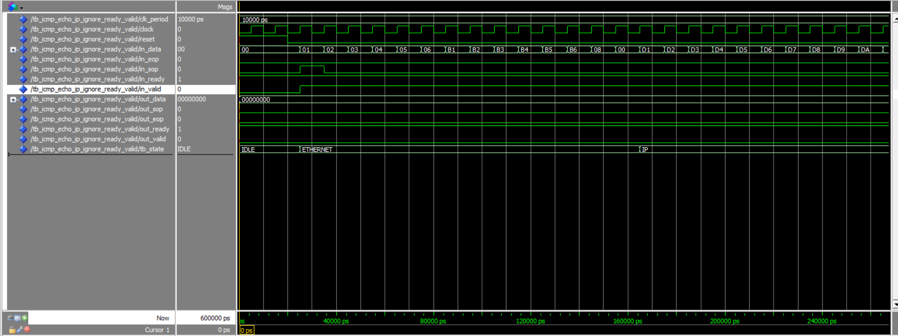

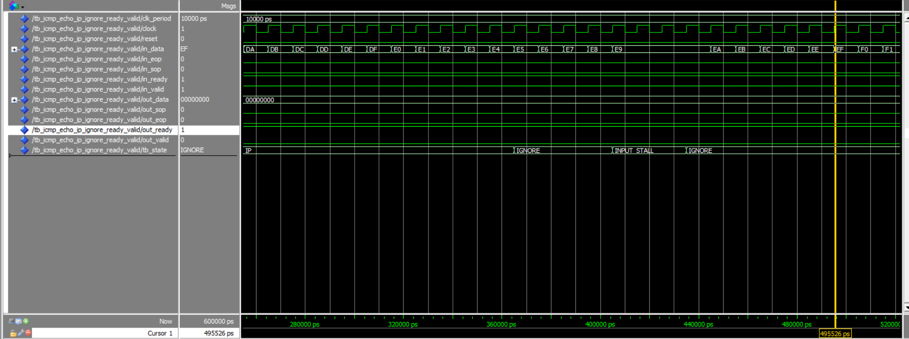

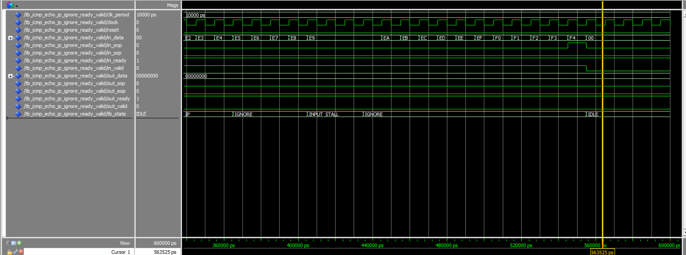

<strong>Slika 16:</strong> Prikaz verifikacije rezultata pomoću ModelSim-a za drugi scenario pogrešne IP adrese i ready/valid handshake mehanizma.

## Drugi scenario verifikacije – neispravno ICMP zaglavlje

U ovom verifikacionom scenariju generisan je Ethernet okvir sa ispravnim Ethernet i IPv4 zaglavljem, ali sa neispravnim ICMP zaglavljem. Nakon analize ICMP polja, modul icmp_echo_responder pravilno prepoznaje nevažeći paket i ignoriše ga.
Rezultati ModelSim simulacije potvrđuju da se u ovom slučaju ne generiše ICMP Echo Reply odgovor, a modul se po završetku prijema okvira ispravno vraća u IDLE stanje.

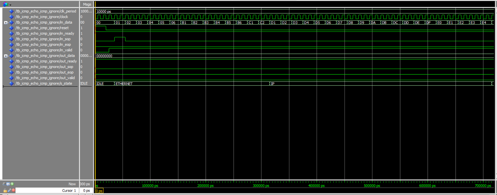

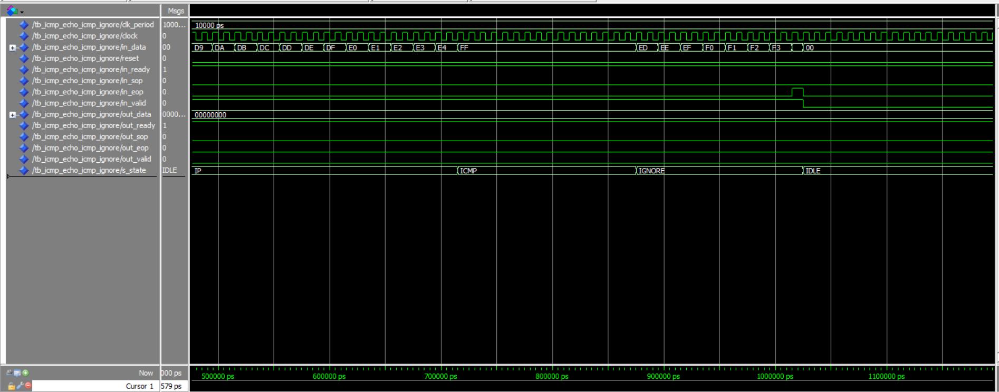

<strong>Slika 17:</strong> Prikaz verifikacije rezultata pomoću ModelSim-a za drugi scenario neispravnog ICMP zaglavlja.

## Drugi scenario verifikacije – neispravno ICMP zaglavlje (ready/valid handshake)

U ovom scenariju testiran je rad modula icmp_echo_responder u slučaju kada pristigli paket sadrži neispravno ICMP zaglavlje, odnosno ICMP poruku koja nije tipa Echo Request ili ne ispunjava očekivani format. Cilj scenarija je potvrditi da se paket pravilno ignoriše, kao i da modul zadrži korektno ponašanje ready/valid handshake mehanizma tokom odbacivanja paketa.
Tokom prijema okvira, ulazni bajtovi se prihvataju isključivo u ciklusima kada su signali in_valid i in_ready istovremeno aktivni. U slučaju privremene deaktivacije signala in_ready, prijem podataka se pauzira bez narušavanja integriteta ulaznog toka, a obrada se nastavlja po ponovnoj aktivaciji signala in_ready.
Nakon obrade Ethernet i IPv4 zaglavlja, te detekcije neispravnog ICMP zaglavlja, modul prelazi u stanje IGNORE, gdje nastavlja prihvat preostalih bajtova ulaznog okvira do signala in_eop, bez generisanja ICMP Echo Reply poruke.
Na izlaznom interfejsu, tokom cijelog scenarija signal out_valid ostaje neaktivan bez obzira na stanje signala out_ready, čime se potvrđuje da modul ne emituje nikakve izlazne podatke za pakete sa neispravnim ICMP zaglavljem.

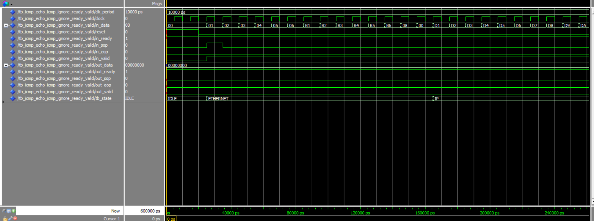

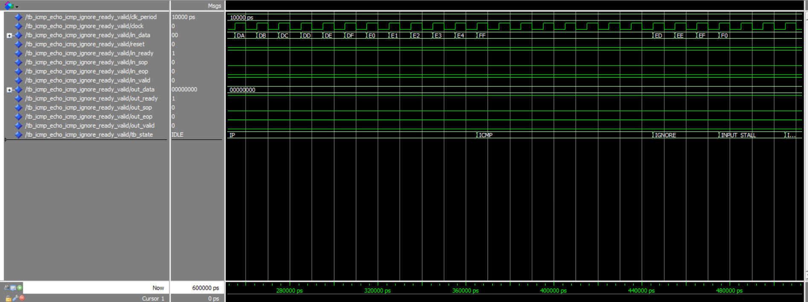

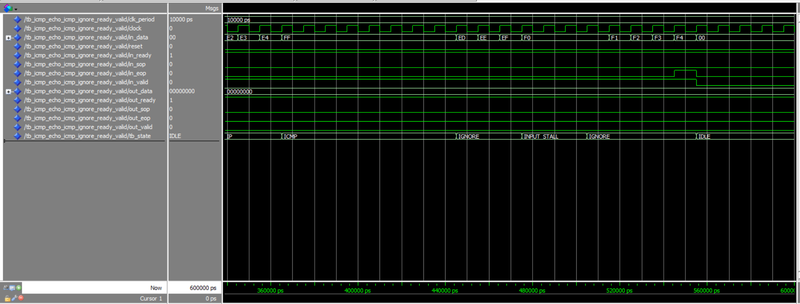

<strong>Slika 18:</strong> Prikaz verifikacije rezultata pomoću ModelSim-a za drugi scenario neispravnog ICMP zaglavlja i ready/valid handshake mehanizma.

# Zaključak

U okviru ovog projekta realizovan je ICMPv4 Echo Responder modul koji omogućava prijem, analizu i obradu ICMP Echo Request paketa, te generisanje odgovarajućih ICMP Echo Reply poruka. Modul je projektovan kao sekvencijalni sklop zasnovan na konačnom automatu (FSM), uz korištenje ready/valid handshake mehanizma, čime je obezbijeđen pouzdan i deterministički prijenos podataka bez gubitka paketa.
Funkcionalnost modula verifikovana je kroz detaljne FSM dijagrame, WaveDrom vremenske dijagrame, kao i simulacije u ModelSim okruženju. Rezultati simulacija potvrđuju da modul ispravno prepoznaje Ethernet, IPv4 i ICMP zaglavlja, pravilno filtrira neispravne ili neadresirane pakete, te korektno generiše ICMP Echo Reply isključivo za validne ICMP Echo Request okvire. 

Dobijeni rezultati potvrđuju da realizovani modul u potpunosti ispunjava definisane funkcionalne zahtjeve ICMPv4 Echo Responder-a, te da obezbjeđuje pouzdan i stabilan rad u svim testiranim scenarijima. Implementacija predstavlja osnovu za dalji razvoj i nadogradnju sistema, pri čemu se buduća unapređenja mogu odnositi na podršku za dodatne ICMP tipove poruka, proširenje funkcionalnosti na IPv6 protokol, kao i integraciju modula u složenije mrežne procesore i hardverske mrežne sisteme.

## Literatura
[1] "Detection of Covert Channels over ICMP Protocol", Dostupno na: https://hal.science/hal-02381398/file/AICCSA%202017%20sirine%20sayadi.pdf

[2] "The Design and Implementation of an IPv6/IPv4 Network Address and Protocol Translator", Dostupno na: https://www.usenix.org/legacy/publications/library/proceedings/usenix98/full_papers/fiuczynski/fiuczynski.pdf

[3] Volnei A. Pedroni, Circuit Design and Simulation with VHDL (poglavlje 11), The MIT Press, Cambridge, Massachussets, 2nd edition, 2010
    
[4] Kaljić E., "Predavanje 2 - "Funkcije paketskog čvorišta", nastavni materijal na predmetu Arhitekture paketskih čvorišta, Univerzitet u Sarajevu,      Elektrotehnički fakultet, 2024/2025.

[5] Intel, F. P. G. A., Avalon® interface specifications., Tech. Rep., MNL-AVABUSREF, 2021.

