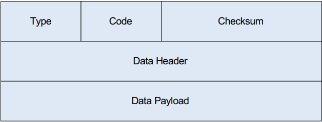

# ICMPv4-Echo-Responder

## Uvod

Internet Control Message Protocol (ICMP) predstavlja jedan od ključnih protokola u okviru TCP/IP arhitekture. Funkcioniše na mrežnom sloju i prvenstveno se koristi za razmjenu kontrolnih poruka između mrežnih uređaja. ICMP paketi obično nastaju kao odgovor na određeni problem u komunikaciji ili kao rezultat mrežnih provjera drugih  protokola [1].

Kao što je prikazano na slici 1, ICMP zaglavlje sastoji se od nekoliko osnovnih polja: 
* Type (tip)
* Code (kod)
* Checksum (kontrolna suma).
  
U dijelu podatka mogu biti definisana dodatna polja, poput identifikatora i sekvencijskog broja, koji se koriste u ICMP echo zahtjevima (tip 8) i echo odgovorima (tip 0) [1].

<strong>Slika 1:</strong> Prikaz ICMP format okvira.

ICMPv4 (Internet Control Message Protocol verzija 4) je verzija ICMP protokola koja se koristi unutar IPv4 mreža. Za razliku od nekih drugih protokola višeg sloja, ICMPv4 ne koristi pseudo-zaglavlje prilikom izračunavanja kontrolne sume. Kontrolna suma se računa samo na osnovu ICMP zaglavlja i podataka.
Kod ICMPv4 Echo Respondera, najvažnije su informativne poruke Echo Request (tip 8) i Echo Reply (tip 0). Kada uređaj primi Echo Request, generiše Echo Reply i pri tome je potrebno pravilno podesiti kontrolnu sumu. Budući da se pri kreiranju Echo Reply poruke mijenja prvenstveno polje Type (sa 8 na 0), kontrolna suma se može prilagoditi postepeno, što ubrzava proces odgovora i smanjuje potrebu za ponovnim izračunavanjem cijelog paketa [2].

## Avalon ST
Avalon-ST (Avalon Streaming) je standardno sučelje za jednosmjerni tok podataka sa ready/valid handshake protokolom.

#### Generic parametri

| Parametar     | Tip                        | Opis                                                                 |
|---------------|----------------------------|----------------------------------------------------------------------|
| IP_ADDRESS  | STD_LOGIC_VECTOR(31 DOWNTO 0) | IP adresa čvora, koristi se za provjeru odredišne adrese u ICMP paketima. |
| MAC_ADDRESS | STD_LOGIC_VECTOR(47 DOWNTO 0) | MAC adresa čvora, koristi se za formiranje Ethernet zaglavlja Echo Reply paketa. |

#### Ulazni signali (IN)

| Signal      | Tip                        | Opis                                                                 |
|-------------|----------------------------|----------------------------------------------------------------------|
| clock     | STD_LOGIC                | Glavni takt modula.                                                   |
| reset     | STD_LOGIC                | Resetuje modul i FSM u početno stanje (IDLE).                       |
| in_data   | STD_LOGIC_VECTOR(7 DOWNTO 0) | Ulazni bajtovi podataka sa Avalon-ST interfejsa.                     |
| in_valid  | STD_LOGIC                | Indikator da je in_data ispravan.                                     |
| in_sop    | STD_LOGIC                | Start of Packet – označava početak paketa.                            |
| in_eop    | STD_LOGIC                | End of Packet – označava kraj paketa.                                 |
| out_ready | STD_LOGIC                | Indikator da je odredište spremno za prijem izlaznih podataka.        |

#### Izlazni signali (OUT)

| Signal       | Tip                        | Opis                                                                 |
|--------------|----------------------------|----------------------------------------------------------------------|
| in_ready   | STD_LOGIC                | Signal da modul može primiti novi bajt podataka.                     |
| out_data   | STD_LOGIC_VECTOR(7 DOWNTO 0) | Izlazni bajtovi podataka (Echo Reply paket).                         |
| out_valid  | STD_LOGIC                | Indikator da je out_data ispravan i može biti pročitan.              |
| out_sop    | STD_LOGIC                | Start of Packet – označava početak Echo Reply paketa.                |
| out_eop    | STD_LOGIC                | End of Packet – označava kraj Echo Reply paketa.                     |

---
## Identifikovani scenariji
# Scenarij 1 - Echo Request i Echo Reply bez backpressure 

U ovom scenariju ICMPv4 Echo Responder modula prima ICMP Echo Request paket upućen na njegovu IP adresu. Paket dolazi bajt po bajt putem Avalon-ST interfejsa preko signala in_data, uz indikatore in_valid, in_sop i in_eop koji označavaju validnost, početak i kraj paketa. Nakon što je paket kompletno primljen i parsiran, modul odmah generiše ICMP Echo Reply koristeći iste podatke iz Echo Request paketa, uključujući zaglavlje i payload. Slanje Echo Reply paketa preko Avalon-ST izlaza odvija se kontinuirano i neprekidno, jer je out_ready stalno 1, a signali out_data, out_valid, out_sop i out_eop prenose paket bez zastoja ili gubitka podataka. Ovaj scenarij testira osnovnu funkcionalnost modula kada nema backpressure-a, osiguravajući da Echo Reply bude generisan i poslan odmah.

# Scenarij 2 -  Echo Request i Echo Reply sa backpressure

U ovom scenariju ICMPv4 Echo Responder modula prima ICMP Echo Request paket upućen na njegovu IP adresu. Paket dolazi bajt po bajt putem Avalon-ST interfejsa preko signala in_data, uz indikatore in_valid, in_sop i in_eop koji označavaju validnost, početak i kraj paketa. Nakon što je paket kompletno primljen i parsiran, modul generiše ICMP Echo Reply, ali slanje paketa preko Avalon-ST izlaza može biti privremeno zaustavljeno kada out_ready = 0. Modul čuva paket dok prijemnik ne postane spreman, nakon čega nastavlja kontinuirano slanje Echo Reply paketa koristeći signale out_data, out_valid, out_sop i out_eop. Ovaj scenarij testira ispravnu implementaciju ready/valid handshaking-a i funkcionalnost modula u situacijama kada prijemnik nije spreman da primi podatke, osiguravajući da se Echo Reply paket ne izgubi i bude ispravno poslan kada je izlaz spreman.

# Scenarij 3 - Nije ICMP Echo poruka (ignorisanje)

U ovom scenariju ICMPv4 Echo Responder modula prima paket koji nije ICMP Echo Request. Paket može biti bilo koja druga poruka (npr. TCP, UDP ili drugi tip ICMP poruke). Modul provjerava IP protokol i ICMP type kod polja i kada utvrdi da paket nije Echo Request, ne generiše Echo Reply. Ulazni Avalon-ST signali nastavljaju prenos paketa ka modulu, a izlazni signali ostaju neaktivni za ovaj paket. Modul je spreman za prijem sljedećeg paketa, osiguravajući da se saobraćaj filtrira bez greške.

# Scenarij 4 - Backpressure na ICMP Payload

U ovom scenariju ICMPv4 Echo Responder modula prima ICMP Echo Request paket upućen na njegovu IP adresu. Nakon što modul parsira zaglavlje paketa i pripremi Echo Reply, slanje ICMP payload-a može biti privremeno zaustavljeno ako je signal out_ready = 0. Modul tada čuva trenutni bajt payload-a i čeka dok prijemnik ne postane spreman. Kada out_ready = 1, modul nastavlja slanje preostalih bajtova payload-a koristeći signale out_data, out_valid, out_sop i out_eop. Zaglavlje Echo Reply paketa je već poslano prije pauze, tako da se backpressure odnosi samo na dio koji sadrži ICMP payload. Ovaj scenarij testira sposobnost modula da pravilno upravlja ready/valid handshaking-om tokom slanja podataka i osigurava da Echo Reply paket ne bude izgubljen ili oštećen čak i kada prijemnik privremeno nije spreman.

## Zaključak

## Literatura
[1] "Detection of Covert Channels over ICMP Protocol", Dostupno na: https://hal.science/hal-02381398/file/AICCSA%202017%20sirine%20sayadi.pdf

[2] "The Design and Implementation of an IPv6/IPv4 Network Address and Protocol Translator", Dostupno na: https://www.usenix.org/legacy/publications/library/proceedings/usenix98/full_papers/fiuczynski/fiuczynski.pdf
