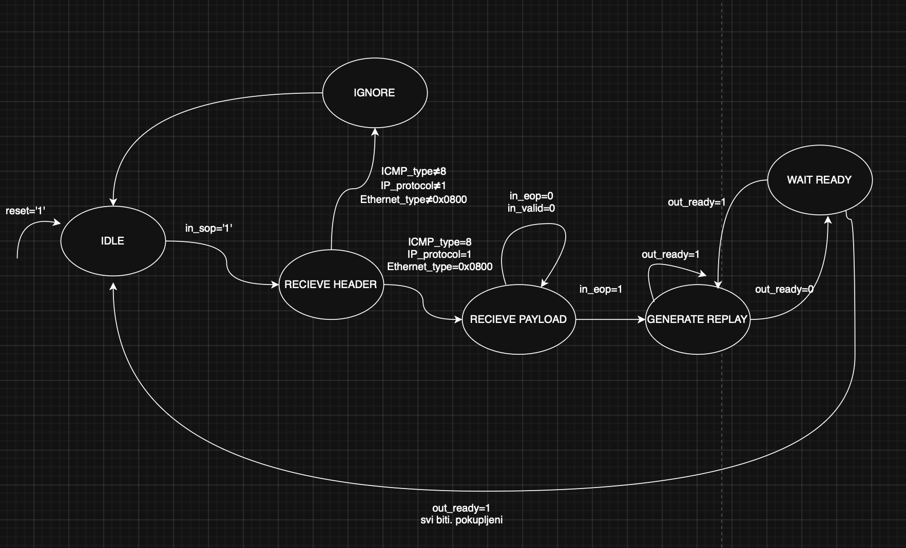

# ICMPv4-Echo-Responder

## Uvod

Internet Control Message Protocol (ICMP) predstavlja jedan od ključnih protokola u okviru TCP/IP arhitekture. Funkcioniše na mrežnom sloju i prvenstveno se koristi za razmjenu kontrolnih poruka između mrežnih uređaja. ICMP paketi obično nastaju kao odgovor na određeni problem u komunikaciji ili kao rezultat mrežnih provjera drugih  protokola [1].

Kao što je prikazano na slici 1, ICMP zaglavlje sastoji se od nekoliko osnovnih polja: 
* Type (tip)
* Code (kod)
* Checksum (kontrolna suma).
  
U dijelu podatka mogu biti definisana dodatna polja, poput identifikatora i sekvencijskog broja, koji se koriste u ICMP echo zahtjevima (tip 8) i echo odgovorima (tip 0) [1].

<strong>Slika 1:</strong> Prikaz ICMP format okvira.

ICMPv4 (Internet Control Message Protocol verzija 4) je verzija ICMP protokola koja se koristi unutar IPv4 mreža. Za razliku od nekih drugih protokola višeg sloja, ICMPv4 ne koristi pseudo-zaglavlje prilikom izračunavanja kontrolne sume. Kontrolna suma se računa samo na osnovu ICMP zaglavlja i podataka.
Kod ICMPv4 Echo Respondera, najvažnije su informativne poruke Echo Request (tip 8) i Echo Reply (tip 0). Kada uređaj primi Echo Request, generiše Echo Reply i pri tome je potrebno pravilno podesiti kontrolnu sumu. Budući da se pri kreiranju Echo Reply poruke mijenja prvenstveno polje Type (sa 8 na 0), kontrolna suma se može prilagoditi postepeno, što ubrzava proces odgovora i smanjuje potrebu za ponovnim izračunavanjem cijelog paketa [2].

## Avalon ST
Avalon-ST (Avalon Streaming) je standardno sučelje za jednosmjerni tok podataka sa ready/valid handshake protokolom.

#### Generic parametri

| Parametar     | Tip                        | Opis                                                                 |
|---------------|----------------------------|----------------------------------------------------------------------|
| IP_ADDRESS  | STD_LOGIC_VECTOR(31 DOWNTO 0) | IP adresa čvora, koristi se za provjeru odredišne adrese u ICMP paketima. |
| MAC_ADDRESS | STD_LOGIC_VECTOR(47 DOWNTO 0) | MAC adresa čvora, koristi se za formiranje Ethernet zaglavlja Echo Reply paketa. |

#### Ulazni signali (IN)

| Signal      | Tip                        | Opis                                                                 |
|-------------|----------------------------|----------------------------------------------------------------------|
| clock     | STD_LOGIC                | Glavni takt modula.                                                   |
| reset     | STD_LOGIC                | Resetuje modul i FSM u početno stanje (IDLE).                       |
| in_data   | STD_LOGIC_VECTOR(7 DOWNTO 0) | Ulazni bajtovi podataka sa Avalon-ST interfejsa.                     |
| in_valid  | STD_LOGIC                | Indikator da je in_data ispravan.                                     |
| in_sop    | STD_LOGIC                | Start of Packet – označava početak paketa.                            |
| in_eop    | STD_LOGIC                | End of Packet – označava kraj paketa.                                 |
| out_ready | STD_LOGIC                | Indikator da je odredište spremno za prijem izlaznih podataka.        |

#### Izlazni signali (OUT)

| Signal       | Tip                        | Opis                                                                 |
|--------------|----------------------------|----------------------------------------------------------------------|
| in_ready   | STD_LOGIC                | Signal da modul može primiti novi bajt podataka.                     |
| out_data   | STD_LOGIC_VECTOR(7 DOWNTO 0) | Izlazni bajtovi podataka (Echo Reply paket).                         |
| out_valid  | STD_LOGIC                | Indikator da je out_data ispravan i može biti pročitan.              |
| out_sop    | STD_LOGIC                | Start of Packet – označava početak Echo Reply paketa.                |
| out_eop    | STD_LOGIC                | End of Packet – označava kraj Echo Reply paketa.                     |

---
# Identifikovani scenariji
## Scenarij 1 - Echo Request i Echo Reply 

U ovom scenariju ICMPv4 Echo Responder modula prima ICMP Echo Request paket upućen na njegovu IP adresu. Paket dolazi bajt po bajt putem Avalon-ST interfejsa preko signala in_data, uz indikatore in_valid, in_sop i in_eop koji označavaju validnost, početak i kraj paketa. Nakon što je paket kompletno primljen i parsiran, modul odmah generiše ICMP Echo Reply koristeći iste podatke iz Echo Request paketa, uključujući zaglavlje i payload. Slanje Echo Reply paketa preko Avalon-ST izlaza odvija se kontinuirano i neprekidno, jer je out_ready stalno 1, a signali out_data, out_valid, out_sop i out_eop prenose paket bez zastoja ili gubitka podataka. Ovaj scenarij testira osnovnu funkcionalnost modula, osiguravajući da Echo Reply bude generisan i poslan odmah.

## Scenarij 2 - Nije ICMP Echo poruka (ignorisanje)

U ovom scenariju ICMPv4 Echo Responder modula prima paket koji nije ICMP Echo Request. Paket može biti bilo koja druga poruka (npr. TCP, UDP ili drugi tip ICMP poruke). Modul provjerava IP protokol i ICMP type kod polja i kada utvrdi da paket nije Echo Request, ne generiše Echo Reply. Ulazni Avalon-ST signali nastavljaju prenos paketa ka modulu, a izlazni signali ostaju neaktivni za ovaj paket. Modul je spreman za prijem sljedećeg paketa, osiguravajući da se saobraćaj filtrira bez greške.

## Scenarij 4 - Backpressure na ICMP Payload

U ovom scenariju ICMPv4 Echo Responder modula prima ICMP Echo Request paket upućen na njegovu IP adresu. Nakon što modul parsira zaglavlje paketa i pripremi Echo Reply, slanje ICMP payload-a može biti privremeno zaustavljeno ako je signal out_ready = 0. Modul tada čuva trenutni bajt payload-a i čeka dok prijemnik ne postane spreman. Kada out_ready = 1, modul nastavlja slanje preostalih bajtova payload-a koristeći signale out_data, out_valid, out_sop i out_eop. Zaglavlje Echo Reply paketa je već poslano prije pauze, tako da se backpressure odnosi samo na dio koji sadrži ICMP payload. Ovaj scenarij testira sposobnost modula da pravilno upravlja ready/valid handshaking-om tokom slanja podataka i osigurava da Echo Reply paket ne bude izgubljen ili oštećen čak i kada prijemnik privremeno nije spreman.

# Dijagram konačnog automata

Konačni automat (engl. Finite State Machine – FSM) predstavlja tehniku modeliranja sekvencijalnih logičkih sklopova koja se često koristi u dizajnu digitalnih komunikacionih sistema i mrežnih procesora. FSM omogućava precizno definisanje ponašanja sistema kroz skup jasno definisanih stanja, prelaza između stanja na osnovu ulaznih signala, kao i generisanje odgovarajućih izlaznih signala. U ovom projektu, konačni automat se koristi za implementaciju ICMPv4 Echo Responder modula, čiji je zadatak prijem, analiza i obrada mrežnih paketa, te generisanje ICMP Echo Reply poruka kao odgovor na primljene ICMP Echo Request pakete.

Dijagram stanja predstavlja grafičku specifikaciju konačnog automata i omogućava intuitivno razumijevanje toka obrade paketa. FSM parsira ulazni tok podataka bajt po bajt putem Avalon-ST interfejsa i identifikuje početak paketa, pri čemu vrši validaciju zaglavlja Ethernet, IP i ICMP slojeva. Nakon obrade ICMP payload-a, automat kontroliše slanje odgovora uz podršku ready/valid mehanizma, uključujući i situacije u kojima dolazi do pojave backpressure-a.

Konačni automat ICMPv4 Echo Responder modula sastoji se od ukupno šest stanja:

1. IDLE – Početno stanje u kojem modul ne obrađuje nikakav paket i spreman je za prijem novog ulaznog toka podataka. Signal reset vraća automat u stanje IDLE, dok je izlazni interfejs neaktivan. Automat ostaje u ovom stanju sve dok signal 'in_sop' ne postane aktivan, što označava početak novog Ethernet paketa.

2. RECEIVE_HEADER – Obrada zaglavlja paketa u kojem se vrši parsiranje i validacija zaglavlja mrežnog paketa. Tokom ovog stanja, automat provjerava:
- da li je Ethernet tip jednak vrijednosti 0x0800, čime se potvrđuje IPv4 protokol,
- da li IP protokol ima vrijednost 1, što označava ICMP,
- da li ICMP type polje ima vrijednost 8, čime se identifikuje ICMP Echo Request poruka.

Ukoliko bilo koji od navedenih uslova nije ispunjen, automat zaključuje da paket nije relevantan za ICMP Echo Responder i prelazi u stanje IGNORE. Ako su svi uslovi ispunjeni, automat prelazi u stanje RECEIVE_PAYLOAD.

3. IGNORE – Ignorisanje paketa koje nisu tip ICMP Echo Request poruke. U ovom stanju, automat nastavlja da prima ulazne podatke sve do kraja paketa, ali ne vrši nikakvu dalju obradu niti generiše izlazne podatke. Na ovaj način se obezbjeđuje da nevalidni paketi ne utiču na rad modula. Kada signal 'in_eop' postane aktivan, što označava kraj paketa, automat se vraća u stanje IDLE.

4. RECEIVE_PAYLOAD – Prijem ICMP payload-a. Ulazni bajtovi se prihvataju sve dok signal 'in_eop' ne označi kraj paketa. Tokom ovog stanja moguće je privremeno skladištenje payload-a radi kasnijeg slanja u ICMP Echo Reply poruci. Nakon prijema kompletnog payload-a, automat prelazi u stanje GENERATE_REPLY.

5. GENERATE_REPLY – Generisanje i slanje ICMP Echo Reply poruke. Tokom ovog stanja, izvode se sljedeće operacije:
- zamjena izvorišne i odredišne MAC adrese,
- zamjena izvorišne i odredišne IP adrese,
- promjena ICMP type polja na vrijednost 0 (Echo Reply),
- slanje istog ICMP payload-a koji je primljen u Echo Request paketu.

Slanje podataka se vrši preko Avalon-ST izlaznog interfejsa uz poštovanje ready/valid handshaking mehanizma. Ako je signal 'out_ready' aktivan, automat kontinuirano šalje podatke. U slučaju da 'out_ready' postane neaktivan, automat prelazi u stanje WAIT_READY.

6. WAIT_READY – stanje koje omogućava ispravno rukovanje situacijama u kojima dolazi do backpressure-a na izlaznom interfejsu. U ovom stanju automat privremeno zaustavlja slanje podataka, zadržavajući trenutni bajt i stanje slanja. Kada signal 'out_ready' ponovo postane aktivan, automat se vraća u stanje GENERATE_REPLY i nastavlja slanje ICMP Echo Reply paketa bez gubitka podataka. Nakon slanja posljednjeg bajta paketa i aktivacije signala 'out_ready', automat se vraća u početno stanje IDLE.

<strong>Slika 3:</strong> Prikaz FSM dijagrama pomoću alata draw.io.

# Modeliranje u VHDL-u

# Verifikacija rezultata pomoću simulacijskog alata ModelSim

# Zaključak

## Literatura
[1] "Detection of Covert Channels over ICMP Protocol", Dostupno na: https://hal.science/hal-02381398/file/AICCSA%202017%20sirine%20sayadi.pdf

[2] "The Design and Implementation of an IPv6/IPv4 Network Address and Protocol Translator", Dostupno na: https://www.usenix.org/legacy/publications/library/proceedings/usenix98/full_papers/fiuczynski/fiuczynski.pdf

[3] Volnei A. Pedroni, Circuit Design and Simulation with VHDL (poglavlje 11), The MIT Press, Cambridge, Massachussets, 2nd edition, 2010

[4] Intel, F. P. G. A., Avalon® interface specifications., Tech. Rep., MNL-AVABUSREF, 2021.

